# LLM Usage Guide

This guide explains how to use different LLM providers in the Arshai framework with the unified function interface and progressive streaming capabilities.

## Overview

Arshai provides a consistent API across all LLM providers with support for:
- **Regular Functions**: Tools that return results to the conversation
- **Background Tasks**: Fire-and-forget functions that run independently  
- **Progressive Streaming**: Real-time function execution during streaming
- **Structured Output**: Type-safe response formatting

## Supported Providers

All providers implement the same unified interface, ensuring consistent behavior across different LLM services:

```mermaid
graph TB
    subgraph "Unified Interface"
        UI[ILLMInput]
        UI --> RF[regular_functions]
        UI --> BT[background_tasks]
        UI --> ST[structure_type]
    end

    subgraph "Provider Implementations"
        O[OpenAI Client<br/>• Direct API integration<br/>• Function-based structured output<br/>• Delta streaming]
        G[Gemini Client<br/>• Native SDK integration<br/>• Dual authentication<br/>• Auto-schema generation]
        A[Azure Client<br/>• Enterprise deployment<br/>• Native structured parsing<br/>• Event-driven streaming]
        R[OpenRouter Client<br/>• HTTP proxy access<br/>• Safe connection handling<br/>• Multi-model access]
        AG[AI Gateway<br/>• Universal OpenAI-compatible<br/>• Custom headers support<br/>• Gateway agnostic]
        CF[Cloudflare Gateway<br/>• DEPRECATED<br/>• Use AI Gateway instead]
    end

    UI --> O
    UI --> G
    UI --> A
    UI --> R
    UI --> AG
    UI -.-> CF

    style UI fill:#e1f5fe
    style O fill:#fff3e0
    style G fill:#e8f5e8
    style A fill:#f3e5f5
    style R fill:#ffebee
    style AG fill:#e8f5e9
    style CF fill:#ffcccc
```



**Provider-Specific Strengths:**
- **OpenAI**: Direct API integration with function-based structured output
- **Google Gemini**: Native SDK with dual authentication support
- **Azure OpenAI**: Enterprise deployment with native structured parsing
- **OpenRouter**: HTTP proxy client with safe connection handling
- **AI Gateway**: Universal client for any OpenAI-compatible gateway (Cloudflare, LiteLLM, custom gateways)
- **Cloudflare Gateway**: ⚠️ DEPRECATED - Use AI Gateway instead

## Basic Usage

### Simple Chat

```python
from arshai.core.interfaces.illm import ILLMInput, ILLMConfig
from arshai.llms.openai import OpenAIClient

# Configure the client
config = ILLMConfig(
    model="gpt-4o",
    temperature=0.7,
    max_tokens=1000
)

client = OpenAIClient(config)

# Simple chat
input_data = ILLMInput(
    system_prompt="You are a helpful assistant.",
    user_message="What is the capital of France?"
)

response = await client.chat(input_data)
print(response["llm_response"])  # "The capital of France is Paris."
```

### Using Regular Functions

Regular functions return results that become part of the conversation:

```python
def calculate_power(base: float, exponent: float) -> float:
    """Calculate base raised to the power of exponent."""
    return base ** exponent

def get_weather(location: str) -> str:
    """Get current weather for a location."""
    # Your weather API integration
    return f"Weather in {location}: 22°C, sunny"

# Chat with functions
input_data = ILLMInput(
    system_prompt="You are a helpful assistant with access to tools.",
    user_message="What's 2 to the power of 8, and what's the weather in Tokyo?",
    regular_functions={
        "calculate_power": calculate_power,
        "get_weather": get_weather
    }
)

response = await client.chat(input_data)
# The LLM will call both functions and incorporate results in its response
```

### Using Background Tasks

Background tasks run independently without returning results to the conversation:

```python
def send_notification(event: str, details: str = "User interaction") -> None:
    """BACKGROUND TASK: Send notification to admin channel.
    This task runs independently in fire-and-forget mode - no results 
    will be returned to the conversation."""
    # Your notification logic here
    print(f"📧 Admin notification: {event} - {details}")

def log_interaction(user_id: str, action: str, metadata: dict = None) -> None:
    """BACKGROUND TASK: Log user interaction for analytics.
    Runs independently without affecting the conversation flow."""
    # Your logging logic here
    print(f"📊 Logged: {user_id} performed {action}")

input_data = ILLMInput(
    system_prompt="You are a helpful assistant.",
    user_message="Hello, can you help me with Python programming?",
    background_tasks={
        "send_notification": send_notification,
        "log_interaction": log_interaction
    }
)

response = await client.chat(input_data)
# Background tasks execute automatically but don't affect the response
```

### Combining Regular Functions and Background Tasks

```python
input_data = ILLMInput(
    system_prompt="You are a helpful programming assistant.",
    user_message="Calculate 2^10 and notify the admin",
    regular_functions={
        "calculate_power": calculate_power,
    },
    background_tasks={
        "send_notification": send_notification,
        "log_interaction": log_interaction
    }
)

response = await client.chat(input_data)
# Regular functions provide results to the conversation
# Background tasks execute independently
```

## Streaming with Progressive Execution

Progressive streaming executes functions immediately as they complete during streaming:

### Progressive Streaming Workflow

```mermaid
sequenceDiagram
    participant U as User
    participant C as Client
    participant LLM as LLM Provider
    participant F as Functions
    
    U->>C: Request with functions
    C->>LLM: Start streaming
    
    loop Real-time streaming
        LLM-->>C: "Getting weather for Tokyo..."
        C-->>U: Stream text immediately
        
        LLM-->>C: Function call: get_weather("Tokyo")
        C->>F: Execute immediately (progressive)
        F-->>C: "Weather: 22°C, sunny"
        
        LLM-->>C: "Tokyo is sunny, now calculating..."
        C-->>U: Continue streaming
        
        LLM-->>C: Function call: calculate_power(2, 10)
        C->>F: Execute immediately
        F-->>C: Result: 1024
        
        LLM-->>C: Background task: log_interaction
        C->>F: Fire-and-forget execution
        Note over F: Runs independently
        
        LLM-->>C: "Here are your results..."
        C-->>U: Final response with all results
    end
```



```python
async def stream_with_functions():
    input_data = ILLMInput(
        system_prompt="You are a helpful assistant with access to tools.",
        user_message="Get the weather in 3 different cities and calculate some math",
        regular_functions={
            "get_weather": get_weather,
            "calculate_power": calculate_power
        },
        background_tasks={
            "log_interaction": log_interaction
        }
    )
    
    async for chunk in client.stream(input_data):
        if chunk.get("llm_response"):
            print(chunk["llm_response"])
        
        # Functions execute in real-time during streaming!
        # Background tasks run immediately when called
        # Regular functions provide results back to the stream

await stream_with_functions()
```

## Structured Output

Get type-safe responses using Pydantic models:

```python
from pydantic import BaseModel
from typing import List

class WeatherReport(BaseModel):
    location: str
    temperature: float
    condition: str
    humidity: int

class CityWeather(BaseModel):
    reports: List[WeatherReport]
    summary: str

input_data = ILLMInput(
    system_prompt="You are a weather assistant.",
    user_message="Get weather for Tokyo, London, and New York",
    regular_functions={
        "get_weather": get_weather
    },
    structure_type=CityWeather  # Request structured response
)

response = await client.chat(input_data)
weather_data = response["llm_response"]  # Type: CityWeather
print(f"Summary: {weather_data.summary}")
for report in weather_data.reports:
    print(f"{report.location}: {report.temperature}°C, {report.condition}")
```

## Provider-Specific Configuration

### OpenAI Configuration

```python
# Set environment variable
# OPENAI_API_KEY=your_api_key

config = ILLMConfig(
    model="gpt-4o",  # or gpt-4, gpt-3.5-turbo
    temperature=0.7,
    max_tokens=2000
)
```

### Google Gemini Configuration

```python
# API Key authentication
# GOOGLE_API_KEY=your_api_key

# OR Service Account authentication  
# VERTEX_AI_SERVICE_ACCOUNT_PATH=path/to/service-account.json
# VERTEX_AI_PROJECT_ID=your_project_id
# VERTEX_AI_LOCATION=us-central1

config = ILLMConfig(
    model="gemini-1.5-pro",  # or gemini-1.5-flash
    temperature=0.7
)
```

### Azure OpenAI Configuration

```python
# AZURE_DEPLOYMENT=your_deployment_name
# AZURE_API_VERSION=2024-02-01
# OPENAI_API_KEY=your_azure_api_key

config = ILLMConfig(
    model="gpt-4",  # Must match your Azure deployment
    temperature=0.7
)
```

### OpenRouter Configuration

```python
# OPENROUTER_API_KEY=your_api_key
# OPENROUTER_SITE_URL=your_site_url (optional)
# OPENROUTER_APP_NAME=your_app_name (optional)

config = ILLMConfig(
    model="anthropic/claude-3.5-sonnet",  # Any OpenRouter model
    temperature=0.7
)
```

### AI Gateway Configuration (Recommended)

AI Gateway is a universal client that works with any OpenAI-compatible gateway or proxy, providing maximum flexibility.

```python
from arshai.llms import AIGatewayLLM, AIGatewayConfig

# GATEWAY_BASE_URL=your_gateway_url
# GATEWAY_TOKEN=your_token

config = AIGatewayConfig(
    base_url="https://your-gateway.com/v1",  # Gateway endpoint
    gateway_token="your-token",              # Authentication token
    model="gpt-4o",                          # Model name
    temperature=0.7,
    headers={                                # Optional custom headers
        "X-Organization": "your-org",
        "X-Environment": "production"
    }
)

client = AIGatewayLLM(config)
```

**Use Cases:**
- **Cloudflare AI Gateway**: Multi-provider unified endpoint with caching
- **LiteLLM Proxy**: Unified interface to 100+ LLM providers
- **Custom Enterprise Gateways**: Internal proxies with custom authentication
- **Regional Endpoints**: Region-specific OpenAI deployments
- **Azure OpenAI**: Microsoft's OpenAI service

**Example Configurations:**

```python
# Cloudflare AI Gateway
config = AIGatewayConfig(
    base_url="https://gateway.ai.cloudflare.com/v1/{account_id}/{gateway_id}/compat",
    gateway_token=os.getenv("CLOUDFLARE_GATEWAY_TOKEN"),
    model="anthropic/claude-sonnet-4-5"
)

# LiteLLM Proxy
config = AIGatewayConfig(
    base_url="http://localhost:4000",
    gateway_token=os.getenv("LITELLM_TOKEN"),
    model="gpt-4o"
)

# Custom Enterprise Gateway
config = AIGatewayConfig(
    base_url="https://api.mycompany.com/v1",
    gateway_token=os.getenv("ENTERPRISE_TOKEN"),
    model="custom-model",
    headers={"X-Department": "engineering"}
)
```

### Cloudflare AI Gateway Configuration (BYOK) - DEPRECATED

⚠️ **DEPRECATED**: Use `AIGatewayLLM` instead. This client will be removed in a future version.

**Migration Guide:**
```python
# Old (deprecated)
from arshai.llms import CloudflareGatewayLLM, CloudflareGatewayLLMConfig
config = CloudflareGatewayLLMConfig(
    account_id="xxx",
    gateway_id="my-gateway",
    gateway_token="token",
    provider="anthropic",
    model="claude-sonnet-4-5"
)

# New (recommended) - Use AI Gateway
from arshai.llms import AIGatewayLLM, AIGatewayConfig
config = AIGatewayConfig(
    base_url="https://gateway.ai.cloudflare.com/v1/xxx/my-gateway/compat",
    gateway_token="token",
    model="anthropic/claude-sonnet-4-5"
)
```

<details>
<summary>Legacy Cloudflare Configuration (click to expand)</summary>

### Cloudflare AI Gateway Configuration (BYOK) - Legacy

Cloudflare AI Gateway uses BYOK (Bring Your Own Key) mode where provider API keys are stored in the Cloudflare dashboard, not in your code. Only the gateway token is needed.

```python
from arshai.llms import CloudflareGatewayLLM, CloudflareGatewayLLMConfig

# CLOUDFLARE_GATEWAY_TOKEN=your_gateway_token (or pass in config)

config = CloudflareGatewayLLMConfig(
    account_id="your-cloudflare-account-id",
    gateway_id="your-gateway-id",
    gateway_token="your-gateway-token",  # Or use env var
    provider="openrouter",               # Provider name
    model="openai/gpt-4o-mini",          # Model name
    temperature=0.7,
)

client = CloudflareGatewayLLM(config)
```

**Benefits of Cloudflare Gateway:**
- Centralized API key management (keys stored in Cloudflare)
- Multi-provider access from single gateway
- Built-in caching and rate limiting
- Unified analytics dashboard
- Easy provider switching without code changes

**Supported Providers:**
- `openai` - GPT-4, GPT-4o, GPT-3.5
- `anthropic` - Claude 3.5 Sonnet, Claude 3 Opus
- `google-ai-studio` - Gemini Pro, Gemini Flash
- `openrouter` - Access to 100+ models
- `groq` - Llama, Mixtral
- `mistral` - Mistral Large, Medium
- `cohere` - Command R+
- And more...

</details>

## Best Practices

### Function Design

1. **Clear Documentation**: Always include descriptive docstrings
2. **Type Hints**: Use Python type hints for better schema generation
3. **Background Task Declaration**: Prefix background task docstrings with `"BACKGROUND TASK:"`
4. **Error Handling**: Design functions to handle edge cases gracefully

```python
def good_function_example(location: str, units: str = "celsius") -> str:
    """Get current weather for a specific location.
    
    Args:
        location: City name or coordinates
        units: Temperature units (celsius, fahrenheit)
    
    Returns:
        Weather description string
    """
    try:
        # Your implementation
        return f"Weather in {location}: 22°{units[0].upper()}"
    except Exception as e:
        return f"Weather data unavailable for {location}"
```

### Performance Optimization

1. **Use Streaming**: For real-time user experience with function calls
2. **Background Tasks**: Use for logging, notifications, non-essential operations
3. **Function Grouping**: Group related functions in the same call when possible
4. **Model Selection**: Choose appropriate model size for your use case

### Error Handling

```python
try:
    response = await client.chat(input_data)
    usage = response.get("usage", {})
    print(f"Tokens used: {usage.get('total_tokens', 0)}")
except Exception as e:
    print(f"LLM call failed: {e}")
    # Handle error appropriately
```

## Observability and Monitoring

### Basic Observability Setup

Add observability to any LLM client with the constructor parameter:

```python
from arshai.llms.openai import OpenAIClient
from arshai.observability import ObservabilityManager, ObservabilityConfig

# Configure observability
obs_config = ObservabilityConfig(
    service_name="my-ai-application",
    track_token_timing=True,
    metrics_enabled=True
)
obs_manager = ObservabilityManager(obs_config)

# Pass to client constructor
config = ILLMConfig(model="gpt-4o", temperature=0.7)
client = OpenAIClient(config, observability_manager=obs_manager)

# Use client normally - metrics are automatically collected
response = await client.chat(input_data)
```

### Production Monitoring

For production environments with OpenTelemetry:

```python
from opentelemetry import trace
from opentelemetry.exporter.otlp.proto.grpc import OTLPSpanExporter
from opentelemetry.sdk.trace import TracerProvider
from opentelemetry.sdk.trace.export import BatchSpanProcessor

# Configure OpenTelemetry
trace.set_tracer_provider(TracerProvider())
tracer_provider = trace.get_tracer_provider()

# Add OTLP exporter
otlp_exporter = OTLPSpanExporter(
    endpoint="your-otel-collector:4317",
    insecure=True
)
span_processor = BatchSpanProcessor(otlp_exporter)
tracer_provider.add_span_processor(span_processor)

# Create observability manager
obs_config = ObservabilityConfig(
    service_name="production-ai-service",
    track_token_timing=True,
    metrics_enabled=True,
    trace_enabled=True
)
obs_manager = ObservabilityManager(obs_config)

# Use with any client
client = AzureClient(config, observability_manager=obs_manager)
```

### Metrics Collected

Observability automatically tracks:
- **Duration**: Total call time in milliseconds
- **Token Usage**: Input, output, and total tokens
- **Provider & Model**: Auto-detected from client
- **Method**: Whether chat or stream was used
- **Status**: Success or error with details
- **Function Calls**: Number and types of functions executed

## Usage Tracking

All LLM calls return standardized usage information:

```python
response = await client.chat(input_data)
usage = response["usage"]

print(f"Input tokens: {usage['input_tokens']}")
print(f"Output tokens: {usage['output_tokens']}")  
print(f"Total tokens: {usage['total_tokens']}")
print(f"Provider: {usage['provider']}")
print(f"Model: {usage['model']}")

# Optional fields (when available)
if usage.get('thinking_tokens'):
    print(f"Reasoning tokens: {usage['thinking_tokens']}")
if usage.get('tool_calling_tokens'):
    print(f"Function calling tokens: {usage['tool_calling_tokens']}")
```

## Common Patterns

### Multi-Step Workflows

```python
# The LLM can orchestrate complex multi-step workflows automatically
input_data = ILLMInput(
    system_prompt="You are a data analyst. Always verify calculations and log important steps.",
    user_message="Analyze sales data: get Q1 revenue, calculate growth rate, create report, and notify stakeholders",
    regular_functions={
        "get_revenue_data": get_revenue_data,
        "calculate_growth_rate": calculate_growth_rate,
        "create_report": create_report
    },
    background_tasks={
        "notify_stakeholders": notify_stakeholders,
        "log_analysis": log_analysis
    },
    max_turns=5  # Allow multiple function calling iterations
)
```

### Error Recovery

```python
def robust_api_call(endpoint: str) -> str:
    """Make API call with error handling."""
    try:
        # Your API call logic
        return "API call successful"
    except Exception as e:
        return f"API call failed: {str(e)}"

# The LLM can handle function failures gracefully
input_data = ILLMInput(
    system_prompt="If any API calls fail, suggest alternative approaches.",
    user_message="Get user data and send welcome email",
    regular_functions={
        "robust_api_call": robust_api_call
    }
)
```

This unified interface provides a powerful, consistent way to integrate LLM capabilities into your applications with real-time function execution and comprehensive error handling.

## Further Reading

- **[Technical Architecture](../technical/llm_architecture.md)**: Deep dive into the framework's architecture and design principles
- **[Contributing Guide](../contributing/llm_providers.md)**: Learn how to add new LLM providers to the framework
- **[Implementation Notes](../../arshai/llms/README.md)**: Critical implementation details for contributors and maintainers